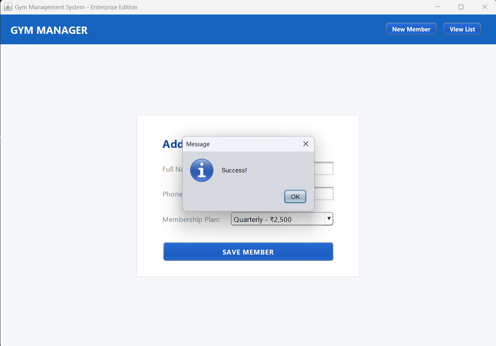
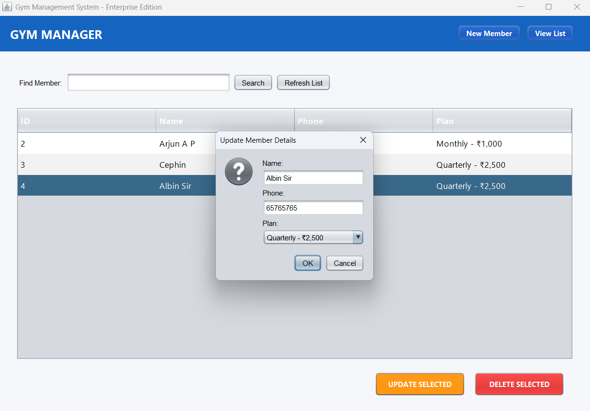

Gym Membership Management System 🏋️‍♂️

Team Members
Member 1: Arjun A P
Member 2: cephin Jeason

Course:  Object Oriented Programming Using Java 

📌 Problem Statement & Objective
Gym owners often struggle with manual record-keeping, leading to errors in payment tracking and member management. This project provides a Mini Real-World Java Application designed to automate the registration, storage, and management of gym memberships through a user-friendly interface.

Objective: To implement a robust system that handles CRUD (Create, Read, Update, Delete) operations for gym records while ensuring data persistence through a database.

🚀 Features
Member Registration: Add new members with details like name, phone, and specific Indian Rupee (₹) plans.

Database Persistence: Integrated SQLite via JDBC to ensure data remains saved even after closing the app.

Search Functionality: Instantly filter and find members by their names.

Full CRUD Support: Dedicated buttons to Update member details or Delete expired records.

Modern GUI: Clean, professional interface built with Java Swing using the Nimbus Look & Feel.

🛠️ Technologies Used

Language: Java 
GUI Framework: Java Swing 
Database: SQLite (JDBC) 
IDE: IntelliJ IDEA 
 
📖 Core Java Concepts Applied (CO5)
This project serves as a demonstration of Course Outcome 5 (CO5):

OOP Principles: Utilizes Classes and Encapsulation for logical data structuring.

Inheritance: The GUI components extend JFrame to leverage standard Java windowing.

Exception Handling: Implemented try-catch blocks for input validation and database error management.

Multithreading: Uses SwingUtilities.invokeLater for stable and thread-safe GUI execution.

JDBC: Secure database connectivity using the sqlite-jdbc driver.

⚙️ Steps to Run the Program
1.Clone the Repository: git clone 
2.Open in IntelliJ IDEA: Select the project folder.
3.Add Library: * Go to File > Project Structure > Libraries.
4.Add the sqlite-jdbc-3.51.2.0.jar file included in this repository.
5.Run: Execute the Main.java file.

📸 Screenshots
The project includes a dedicated screenshots folder as required.

Conclusion
The Gym Membership Management System successfully demonstrates the integration of core Object-Oriented Programming principles with a functional Graphical User Interface and backend database. By developing this application, we have achieved the following:

Modular Architecture: Successfully separated the application logic into a Model-View-Controller (MVC) inspired structure using DatabaseHandler, GymGUI, and Main classes.
Data Persistence: Leveraged JDBC and SQLite to ensure member records are stored permanently and can be retrieved, updated, or deleted efficiently.
User Experience: Created a user-friendly interface in Java Swing that provides meaningful interaction through forms, buttons, and real-time data tables.

Technical Compliance: Adhered to all CO5 criteria, including the implementation of exception handling for data safety and the use of version control via GitHub for collaborative hosting.

This project serves as a comprehensive example of how Java can be used to solve real-world administrative problems through secure and scalable software design.
